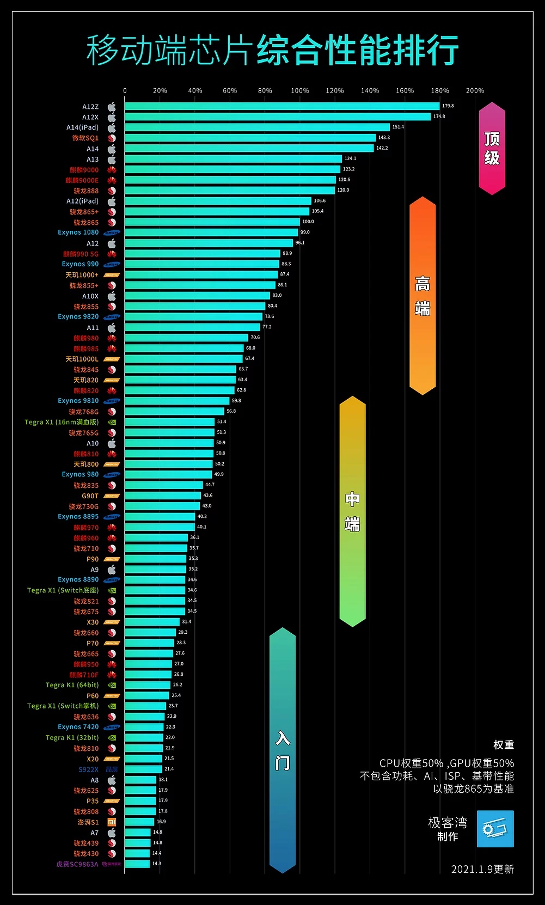

# 移动CPU综合性能天梯图

[极客湾移动芯片性能排行榜](https://www.socpk.com/)

这个排行榜让人很尴尬，看来只有拼了老命，才能让自己很优雅啊！为什么这么说？因为只有苹果的芯片，设计得最好，常年霸占榜首，才能那么从容优雅地给自己起名字，A7-A14，一路走过去。

其他的芯片，命名都是让人一言难尽，比如三星的Exynos系列，分数最高的是Exynos 1080，次之的是Exynos 990，再次之的是Exynos 9820，什么鬼逻辑。

高通本来是骁龙6\*\*，骁龙7\*\*，骁龙8\*\*，也都还好，但现在来来一个骁龙888，为了讨好客户，真是煞费苦心了。但是，骁龙888很明显翻车了，性能其实不如骁龙865（需要解除其频率限制，超频），功耗还更高，那还不如直接用骁龙865超频得了，设计什么新芯片。

最骚的还是爱国品牌，本来8\*\*，9\*\*，还有些规律，后来就变成了9000了，不但一下子从三位数变到了4位数，而且马上就要5位数了。
