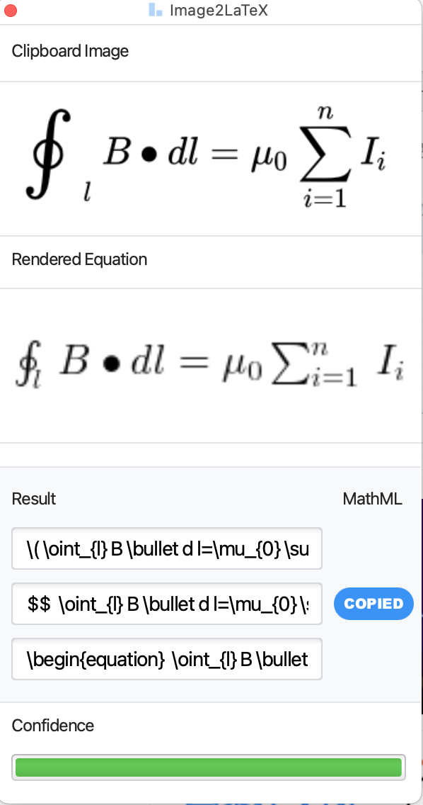
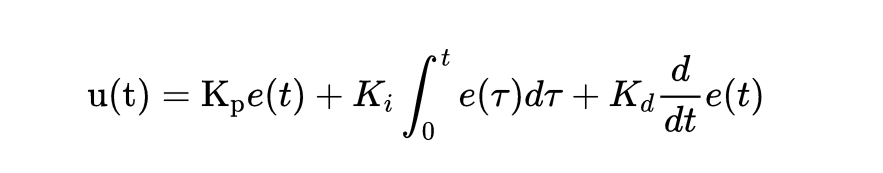

# LaTeX

介绍<sup>[1]</sup>：

LaTeX（/ˈlɑːtɛks/，常被讀作/ˈlɑːtɛk/或/ˈleɪtɛk/），是一种基于TEX的排版系统，由美国计算机科学家莱斯利·兰伯特在20世纪80年代初期开发，利用这种格式系統的處理，即使使用者没有排版和程序设计的知识也可以充分发挥由TEX所提供的强大功能，不必一一親自去設計或校對，能在几天，甚至几小时内生成很多具有书籍品質的印刷品。对于生成复杂表格和**数学**公式，这一点表现得尤为突出。因此它非常适用于生成高印刷质量的科技和**数学、物理**文档。这个系统同样适用于生成从简单的信件到完整书籍的所有其他种类的文档。

## LaTeX编辑编译环境

我都是用的VSCode加插件，网上有很多相关教程，简单易懂，比如[使用VSCode编写LaTeX](https://zhuanlan.zhihu.com/p/38178015)<sup>[4]</sup>，这里就不再赘述。

## LaTeX公式

LaTeX公式示例(安培环路定理)，源码：

```LaTeX
$$
 \oint_{l} B \bullet d l=\mu_{0} \sum_{i=1}^{n} I_{i} 
$$
```

渲染结果：

$${\oint_{l} B \bullet d l=\mu_{0} \sum_{i=1}^{n} I_{i}}$$

## Image2LaTeX工具

### Image2LaTeX是什么？

有时候需要截图并生成Latex公式，有一个好用的工具：Mathpix Snipping Tool，但是这个工具每个月只能使用50次，再多就要付费了<sup>[2]</sup>。

但Mathpix有另一个工具：MathpixOCR API，这个工具是图像识别转文本的接口（根据Mathpix的条款，每个账户每月可以免费使用1000次）。

Image2LaTeX：就是一个类似Mathpix Snipping Tool的工具，它的作用就是调用MathpixOCR API，将图像上传，从接口获取转化后的文本，然后再行转换为Latex公式（或者从获取到的文本就是已经转化后的Latex了，不得而知？）。

使用效果（在百度百科上截图安培环路定理的公式）：

<div  align="center">

</div>

### Image2LaTeX下载安装

进入github仓库<https://github.com/blaisewang/img2latex-mathpix>就可以找到对应的release下载并安装使用了。没有特殊步骤，不再详解。

### Image2LaTeX如何配置

需要调用MathpixOCR API，就必须要先配置MathpixOCR API Key：

- 进入<https://mathpix.com>
- 登陆自己的账号
- 进入账户配置界面
- 点击OCR APIs
- 根据指引，新建API Keys

注意：  
新建MathpixOCR API Key，需要有信用卡，首次扣费1美元，且不退回（这没有问题），但他们的条款看起来消费是上不封顶的（按次计费）。感觉若是泄漏了API key，后患无穷！

条款如下：

**Our billing policy**

- First 1K requests are free per month.
- $0.004 per request for 1-100K API calls.
- $0.002 per request for 100K-300K API calls
- $0.001 per request for 300K-infinity API calls
- Billed monthly (1st of every month)

**Setup fee**

- To prevent automated abuse we charge a one-time non-refundable setup fee of $1.

### 如何使用

就是先截图，然后用空格键粘贴到Image2LaTeX，再按enter键就可以调用接口，上传并获取到Latex公式了。

原介绍文档如下<sup>[3]</sup>：  

Use your operating system's default methods (or other tools) to take a screenshot of equations or text (Shift (⇧)-Control (⌃)-Command (⌘)-4 on macOS by default).

Then, press the Space key to preview the screenshot. Or, press the Return or Enter key to send the OCR request directly.

## 使用生成式AI

使用下面的图片，通过POE渠道调用Claude-3-Sonnet，调用文本和图片如下：

convert the equation in the image to Latex：
<div  align="center">

</div>

得到反馈如下

```text
The equation in the image can be represented in LaTeX as:

$u(t) = K_pe(t) + K_i\int_{0}^{t}e(\tau)d\tau + K_d\frac{d}{dt}e(t)$
```

将公式放置到markdown渲染，将会得到：

$$u(t) = K_pe(t) + K_i\int_{0}^{t}e(\tau)d\tau + K_d\frac{d}{dt}e(t)$$

结论：解析完全正确。

## 参考及引用

[1] LATEX <https://zh.wikipedia.org/wiki/LaTeX>
[2] 公式免费转 LaTex 代码，截图、转换一气呵成，每月 1000 次全免费<https://cloud.tencent.com/developer/news/486610>
[3] img2latex-mathpix <https://github.com/blaisewang/img2latex-mathpix>
[4] 使用VSCode编写LaTeX <https://zhuanlan.zhihu.com/p/38178015>
