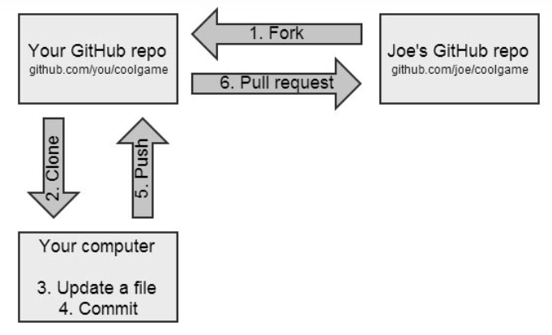

# github使用技巧

## fork, watch和star分别有什么作用

- fork : 复制项目
  - 创建源项目代码库的分支，并拷贝到自己的账号中
  - 某个GitHub项目可能存在bug，或者你想帮助原项目优化一下，这时候你可以使用Fork功能[1]
  - Fork一下可以拷贝别人的原项目，然后你在原项目的基础上优化和完善，然后再发起pull request给原项目作者。流程图如下[1]：
    

    
    

- star: 点赞
  - 关注别人项目更新
  - 所有stars可以在个人设置那里看见。
- watch: 观察
  - 当选择Watch后，你会收到这个GitHub项目的所有动态。比如：有人发起pull request或者issue等。接收动态方式包括个人通知中心或者邮箱；
  - 如果某个GitHub项目你感兴趣，你想收到这个项目的所有动态，那么就Watch它，否则就Not watching；
  - star和watch的区别在于前者不会把项目的动态展示在你的dashboard 里，仅作为收藏功能；
  - 不是非常感兴趣的不要watch，太多邮件，神烦。

picture

## 参考及引用

[1] GitHub右上角Watch、Star和Fork详解. 知乎. 云吞铺子. <https://zhuanlan.zhihu.com/p/103695781>
