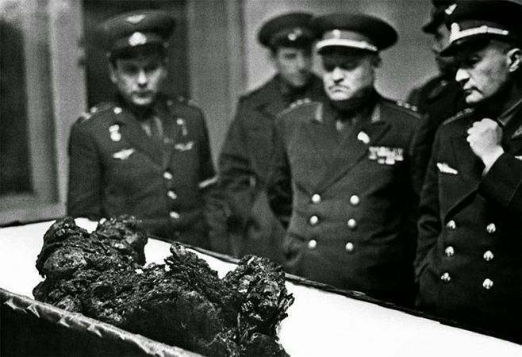

# 从科马洛夫死亡看俄罗斯人有多猛

朋友们调侃俄罗斯人很猛的时候，大部分都是从俄罗斯人开飞机很猛说起，但我每次联想到的都是：俄罗斯人探索太空时更猛，更激进，更不怕死，而闪过脑海的是科马洛夫烧焦的遗骸照片。

弗拉基米尔·米哈伊洛维奇·科马洛夫 （俄语： ВладимирМихайлович Комаров;英语：Vladimir Komarov 1927年3月16日 –1967年4月24日），于1967年4月23日乘坐联盟号飞船升空，并于次日，在未完成既定实验任务，驾驶着有各种故障的飞船返回地球时失事，身亡。下面是他遗骸的照片：

网上很多这个事故的各种不同描述和看法，比如搜狐新闻网站的《[资料:苏联宇航员科马洛夫之死不是偶然惨案](http://news.sohu.com/20120627/n346608619.shtml)》，以及新浪新闻的《[带着203个故障升空，他是载人航天史最悲壮的宇航员](http://tech.sina.com.cn/d/s/2017-10-29/doc-ifynfvar4873715.shtml)》。

说的事件是联盟号飞船连续三次无人驾驶实验失败，但是，苏联人民最终还是按照原计划，将联盟号用于载人实验。因为1967年是十月革命胜利50周年，他们需要一次成功的载人发射任务“给国家献礼”。

另外，看标题就知道，科马洛夫上太空时，其实是很悲壮的，因为，联盟号宇宙飞船有太多未解决的故障了。一句话概括：风萧萧兮易水寒，壮士一去兮不复还！

我将《资料:苏联宇航员科马洛夫之死不是偶然惨案》中的一段原文复制下来：
“  
　　屡试屡败

　　鉴于地面实验基地不足，对有人驾驶飞船的研究，当时在苏联是以发射无人驾驶飞船开始的。1966年底，第一艘无人驾驶的“联盟”号飞船完成了发射前的准备工作。但是这艘飞船的飞行没有成功。飞船进入运行轨道后发现，由于飞船上发动机的工作不稳定，飞船无法改变方向。由于同样的原因，它无法脱离运行轨道。后来总算稍微减慢了飞船的速度，但是降落轨道的弧度不够，结果飞船越过苏联，向外国方向落去。在这种情况下，只好利用专用系统炸毁了飞船。

　　第二艘无人驾驶飞船在发射时出了事。先是运载火箭的自动系统在点火前数秒突然发生故障，停止工作。发射场上忙碌了起来，准备查找原因，国家委员会的成员走出掩体，赶往发射地。突然，一声巨响，飞船营救系统的火药发动机按运载火箭陀螺仪的指今突然起动。结果热调节系统的热载体着火，随后就是飞船燃料罐爆炸，第3级火箭爆炸，整个运载系统爆炸，这一切都是在几秒钟内发生的，幸好，国家委员会的所有成员都没有遇难。

　　第三艘“联盟”号无人驾驶飞船的飞行总说还算正常。不过，降落时还是出了小故障。飞船前部隔热板上有一个小疵点，进入大气层时被烧穿，船体上烧出一个窟窿。飞船恰好落在冰水里，数分钟后，葬身水中。

　　强行发射

　　在无人驾驶飞船的飞行屡次失败后，居然决定发射有人驾驶的“联盟”号飞船！  
”

连续三次无人驾驶飞船实验都没有成功，在这种情况下，强行进行有人驾驶实验，根本就是拿人命当儿戏。

这事如果发生在中国或者美国，感觉决策者会被骂死，如果在日本，应该会有人自杀谢罪了。但这里是苏联，而且是冷战时期的苏联，发生就发生了。那个时候，为了步步走在美国人前面，那是真的不惜一切代价。果然大力出奇迹，他们在美国人之前发射了卫星，进行了载人实验，而且，也先于美国人进行了太空行走，虽然太空行走的阿列克谢·阿尔希波维奇·列昂诺夫(ALEXEI LEONOV)差点没有活着回来（因为他的宇航服膨胀了，进不去飞船，最后进行了大量的放气才重返飞船成功的），可谓是九死一生。但上帝这次没有都眷顾他们。

似乎这件事也是一个转折点，算上这次，联盟号已经连续失败4次，他们被迫放缓他们的登月计划脚步（联盟号本身就是为了登月而开发的，不过美国人的计划是用大火箭一次性发射，飞往月球，苏联是计划在地球发射两个飞船，在太空对接，飞去月球），毫无悬念的，在登月的征途中，苏联落后了。而且，他们至今仍然没有成功登月。而财大气粗的美国，后来者居上，第一个登上了月球，而且，至今仍是唯一一个载人登上月球的国家，也是航天的长期霸主。
