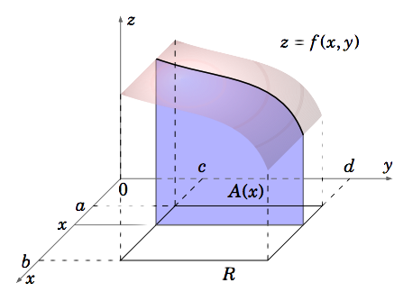

# 多重积分

多重积分（英语：Multiple integral）是定积分的一类，它将定积分扩展到多元函数（多变量的函数），例如求${\displaystyle f(x,y)}$或者${\displaystyle f(x,y,z)}$类型的多元函数的积分。 [1]

正如单变量的正函数的定积分代表函数图像和x轴之间区域的面积一样，正的双变量函数的双重积分代表函数所定义的曲面和包含函数定义域的平面之间所夹的区域的体积。（注意同样的体积也可以通过三变量常函数f(x, y, z) = 1在上述曲面和平面之间的区域中的三重积分得到。若有更多变量，则多元函数的多重积分给出超体积。

n元函数$f(x_{1},x_{2},...,x_{n})$在定义域D上的多重积分:

$$\int\ldots\int_{\mathbf{D}}f(x_1,x_2,\ldots,x_n)\mathrm{~d}x_1\ldots\mathrm{d}x_n$$

因为不可能计算多于一个自变量的函数的不定积分，“不定”多重积分是不存在的。因此所有多重积分都是“定”积分。(不是很理解)

## 范例

譬如，边长为4 × 6 × 5的长方体的体积可以通过两种方法得到：

1. 通过函数f(x, y) = 5在xy平面中的区域D，也就是长方体的底上的双重积分

    $$\iint_{\mathrm{D}}5\mathrm{~d}x\mathrm{~d}y$$

2. 常函数1在长方体上的三重积分:

    $$\iiint1\mathrm{d}x\mathrm{~d}y\mathrm{~d}z$$

## 双重积分 Double Integrals

如下图 [4]:

$$V=\int_a^bA(x)dx=\int_a^b\left[\int_c^df(x,y)dy\right]dx$$

容易看出，这里积分顺序对结果无影响，也就是：

$$V=\int_c^d\left[\int_a^bf(x,y)dx\right]dy$$

例题1. 计算z = 8x +6y 在矩形区域$ (R = [0,1] \times [0,2])$的体积

$$
\begin{aligned}
\text{V}& =\int_0^2\int_0^1(8x+6y)dxdy  \\
&=\int_0^2\left(4x^2+6xy|_{x=0}^{x=1}\right)dy \\
&=\int_0^2(4+6y)dy \\
&=4y+3y^2|_0^2 \\
&=20
\end{aligned}
$$

例题2. 计算$z = $ 在区域$(R = [2,3] \times [1,2])$的体积

$$
\begin{aligned}
\text{V}& =\int_1^2\int_2^3e^{x+y}dxdy\\
&=\int_1^2\left(e^{x+y}|_{x=2}^{x=3} \right)dy \\
&=\int_1^2\left(e^{y+3}-e^{y+2}\right)dy \\
&=\left(e^{y+3} - e^{y+2}\right)|_{x=1}^{x=2} \\
&=e^5-2e^4+e^3
\end{aligned}
$$

例题3. 计算有正负值的积分$ \int_0^{2\pi}\int_0^{\pi}sin(x+y)dx\,dy $

$$
\begin{aligned}
\int_0^{2\pi}\int_0^\pi sin(x+y)dxdy& =\int_0^{2\pi}\left(-cos(x+y)\right|_{x=0}^{x=\pi})dy  \\
&=\int_0^{2\pi}(-cos(y+\pi)+cosy)dy \\
&=-sin(y+\pi)+\left.siny\right|_0^{2\pi}=-sin3\pi+sin2\pi-\left(-sin\pi+sin0\right) \\
&=0
\end{aligned}
$$

## Double Integrals Over a General Region

对于图（a），采用vertical slice，那么将会有如下积分形式：

$$\iint_Rf(x,y)dA=\int_a^b\left[\int_{g_1(x)}^{g_2(x)}f(x,y)dy\right]dx$$

对于图（b），采用horizontal slice，将会有：

$$\iint_Rf(x,y)dA=\int_c^d\left[\int_{g_1(x)}^{g_2(x)}f(x,y)dy \right]dx$$

这样的定义下，R为矩形时，仍然满足，同时，若是f(x,y)在R区域大于等于0，那么积分结果就是R平面到面z=f（x,y)之间的体积。

例题4. 求区域R=(x,y):$0≤x≤1$, $0≤y≤2x^2$上到平面$z=8x+6y$的体积：

解法1. 采用纵向切割

R区域如下图：

$$
\begin{aligned}
V&=\iint_R(8x+6y)dA\\
&= \int_0^1\left[\int_0^{2x^2}(8x+6y)dy\right]dx\\
&= \int_0^1\left[(8xy+3y^2)|_0^{2x^2}\right]dx\\
&=\int_0^1(16x^3+12x^4)dx\\
&=(4x^4+\frac{12}{5}x^5)|_0^1\\
&=\frac{32}{5}
\end{aligned}
$$

解法2. 变更积分次序（横向切割）

$$
\begin{aligned}
V&=\iint_R(8x+6y)dA\\
&= \int_0^2\left[\int_{\sqrt{y/2}}^1(8x+6y)dx\right]dy\\
&= \int_0^2(4x^2+6xy)|_{\sqrt{y/2}}^1dy\\
&= \int_0^2(4+6y-2y-3\sqrt{2}y^{\frac{3}{2}})dy\\
&= (4y+2y^2-\frac{6\sqrt{2}}{5}y^{5/2})|_0^2\\
&= (8 + 8 - \frac{48}{5})\\
&= \frac{32}{5}
\end{aligned}
$$

若是将这种二重积分结果看做体积的话：

$$
\begin{aligned}
V&=\iint_Rf(x,y)dA\\
&=\sum_j\sum_if(x_{i*},y_{j*})\Delta x_i\Delta y_j
\end{aligned}
$$

## Triple Integrals 三重积分

同二重积分一样，可以看作：

$$
\begin{aligned}
\iiint_Sf(x,y,z)dV&=\lim\sum\sum\sum f(x*,y*,z*)\Delta x\Delta y\Delta z
\end{aligned}
$$

当S区域为正六面体，则有：

$$\iiint_Sf(x,y,z)dV=\int_{z_1}^{z_2}\int_{y_1}^{y_2}\int_{x_1}^{x_2}f(x,y,z)dxdydz$$

此时，积分顺序对积分结果无影响。

但若S区域是由下面方案限定的：z在面$z=g_1(x,y)$之上，面$z=g_2(x,y)$之下；而y是在$y=h_1(x)$和$y=h_2(x)$之间，x在a, b之间，那么有：

$$
\begin{aligned}
\underset{S}{\operatorname*{\operatorname*{\iiint}}}f(x,y,z)dV=\int_a^b\int_{h_1(x)}^{h_2(x)}\int_{g_1(x,y)}^{g_2(x,y)}f(x,y,z)dzdydx
\end{aligned}
$$

例7： 计算$\int_0^3\int_0^2\int_0^1(xy+z)dxdydz$

解：略

例8：计算$\int_0^1\int_0^{1-x}\int_0^{2-x-y}(x+y+z)\mathrm{~d}z\mathrm{~d}y\mathrm{~d}x$

解:

$$
\begin{aligned}
&\int_0^1\int_0^{1-x}\int_0^{2-x-y}(x+y+z)\mathrm{~d}z\mathrm{~d}y\mathrm{~d}x\\
&=\int_0^1\int_0^{1-x}(xz+yz+\frac{1}{2}z^2)|_{z=0}^{z=2-x-y}\mathrm{~d}y\mathrm{~d}x\\
&=\int_0^1\int_0^{1-x}(2-\frac{1}{2}x^2-\frac{1}{2}y^2-xy)\mathrm{~d}y\mathrm{~d}x\\
&=\int_0^1(2y-\frac{1}{2}yx^2-\frac{1}{6}y^3-\frac{1}{2}xy^2)|_{y=0}^{y = 1-x}\mathrm{~d}x\\
&=\int_0^1(\frac{11}{6}-2x+\frac{1}{6}x^3)dx\\
&=(\frac{11}{6}x -x^2 +\frac{1}{24}x^4)|_{x=0}^{x=1}\\
&=\frac{21}{24} = \frac{7}{8}
\end{aligned}
$$

解答完毕。

根据上面的例题，有：

$$
\begin{aligned}
\text{V}& =\underset{S}{\operatorname*{\iiint}}1dV  \\
&=\int_a^b\int_{h_1(x)}^{h_2(x)}\int_{g_1(x,y)}^{g_2(x,y)}1dzdydx \\
&=\int_a^b\int_{h_1(x)}^{h_2(x)}\left(g_2(x,y)-g_1(x,y)\right)dydx
\end{aligned}
$$

这也很容易从直观感受知道。它求得就是面$z=g_1(x,y)$到$z=g_2(x,y)$，$y=h_1(x)$和$y=h_2(x)$之间，x在a, b之间的区域的体积。

## 参考及引用

[1] 多重积分. wikipedia<https://zh.wikipedia.org/wiki/%E5%A4%9A%E9%87%8D%E7%A7%AF%E5%88%86>
[2] Multiple integral. wikipedia<https://en.wikipedia.org/wiki/Multiple_integral>
[3] 多重积分. <https://www.sfu.ca/math-coursenotes/Math%20158%20Course%20Notes/chap_MultipleIntegration.html>
[4] Multiple Integrals <https://math.libretexts.org/Bookshelves/Calculus/Vector_Calculus_(Corral)/03%3A_Multiple_Integrals>
